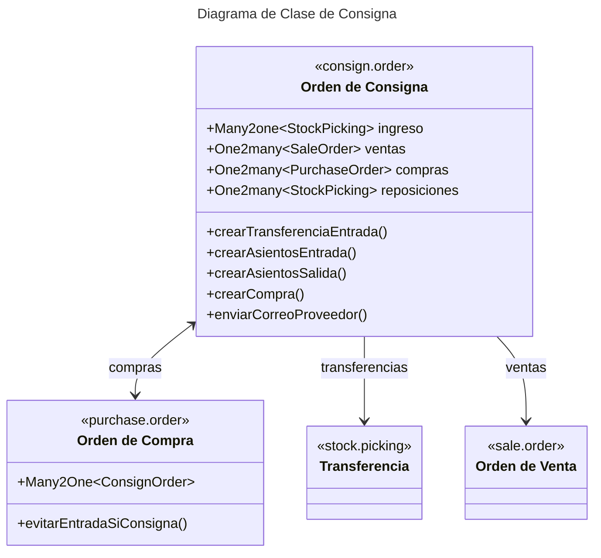
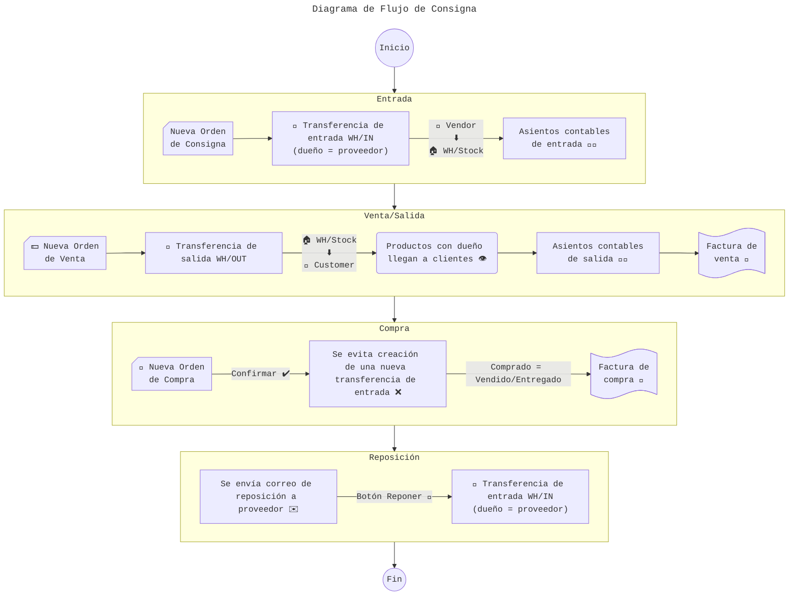

# Consigna

## Orden de Consigna (Consignment Order)

### Modelo de Orden de Consigna

Se plantea la creación de un modelo nuevo _Consignment Order_ que no heredaría atributos ni métodos de _Purchase Order_ sino que contendría los modelos que necesite (composición); también se plantea una modificación mínima del modelo de _PurchaseOrder_ para evitar la creación de transferencias de ingreso si ésta se encuentra asociada con una orden de consigna.

La consigna contendrá las siguientes relaciones:

1. asientos de entrada (account.move): asientos contables de entrada
1. asientos de salida (account.move): asientos contables de salida
1. entrada (stock.picking): el primer ingreso de productos en consigna a almacén
1. salidas (stock.picking): transferencias que contienen productos en consigna
1. reposiciones (stock.picking): los ingresos cuando la mercancía es repuesta
1. compras (purchase.order): compras de los productos en consigna vendidos

> [!NOTE]
> El modelo de PurchaseOrder sería el único modelo que contendría una relación con ConsignOrder

### Flujo de Orden de Consigna

El flujo de la orden de consigna sería el siguiente:

1. Entrada
   1. Creación de orden de consigna
   1. Ingreso de productos con dueño a almacén
   1. Creación de asientos contables de entrada
1. Venta y salida
   1. Creación de orden de venta
   1. Salida de productos de almacén
   1. Si los productos tienen dueño al llegar a clientes:
      1. Crear asientos contables de salida
      1. Crear orden de compra relacionada con la consigna
      1. Crear transferencia de ingreso cuando los productos sean repuestos

## [:back:](README.md)