# Consigna

## Orden de Consigna (Consignment Order)

### Modelo de Orden de Consigna

Se plantea la creación de un modelo nuevo _Consignment Order_ que no heredaría atributos ni métodos de _Purchase Order_ sino que contendría los modelos que necesite (composición); también se plantea una modificación mínima del modelo de _PurchaseOrder_ para evitar la creación de transferencias de ingreso si ésta se encuentra asociada con una orden de consigna.

La consigna contendrá las siguientes relaciones:

1. asientos de entrada (account.move): asientos contables de entrada
1. asientos de salida (account.move): asientos contables de salida
1. entrada (stock.picking): el primer ingreso de productos en consigna a almacén
1. salidas (stock.picking): transferencias que contienen productos en consigna
1. reposiciones (stock.picking): los ingresos cuando la mercancía es repuesta
1. compras (purchase.order): compras de los productos en consigna vendidos

> [!NOTE]
> El modelo de PurchaseOrder sería el único modelo que contendría una relación con ConsignOrder

### Flujo de Orden de Consigna

El flujo de la orden de consigna sería el siguiente:

1. Entrada
   1. Creación de orden de consigna
   1. Ingreso de productos con dueño a almacén
   1. Creación de asientos contables de entrada
1. Venta y salida
   1. Creación de orden de venta
   1. Salida de productos de almacén
   1. Si los productos tienen dueño al llegar a clientes:
      1. Crear asientos contables de salida
      1. Crear orden de compra relacionada con la consigna
      1. Crear transferencia de ingreso cuando los productos sean repuestos

```mermaid
---
title: Diagrama de Flujo de Consigna
---
%%{
  init: {
    "fontFamily": "monospace",
    "flowchart": {
      "htmlLabels": true,
      "curve": "linear"
    }
  }
}%%
flowchart
   direction TB

   classDef new color:#fff,fill:#000,stroke:#00000000,stroke-width:1px,font-weight:bold;

   subgraph in["Entrada"]
      newConsign@{ shape: notch-rect, label: "Nueva Orden<br>de Consigna" } -->
      consignStockIn["🚚 Transferencia de entrada WH/IN<br>(dueño = proveedor)"] -- "🏢 Vendor<br>⬇️<br>🏠 WH/Stock" -->
      journalEntriesIn["Asientos contables<br>de entrada 📙➕"]
   end

   subgraph out["Venta/Salida"]
      newSale@{ shape: notch-rect, label: "💵 Nueva Orden<br>de Venta" } -->
      saleStockOut["🚚 Transferencia de salida WH/OUT"] -- "🏠 WH/Stock<br>⬇️<br>👤 Customer" -->
      reachCostumer("Productos con dueño llegan a clientes 👁️") -->
      journalEntriesOut["Asientos contables<br>de salida 📙➖"] -->
      newInvoiceOut@{ shape: flag, label: "Factura de<br>venta 🧾" }
   end
   
   subgraph purchase["Compra"]
      newPurchase@{ shape: notch-rect, label: "🛒 Nueva Orden<br>de Compra" } -- "Confirmar ✔️" -->
      blockTransfer["Se evita creación de una nueva transferencia de entrada ❌"] -- "Comprado = Vendido/Entregado" -->
      newInvoiceIn@{ shape: flag, label: "Factura de<br>compra 🧾" }
   end

   subgraph reposition["Reposición"]
      repositionEmail["Se envía correo de reposición a proveedor ✉️"] -- "Botón Reponer 🔄" -->
      repositionStockIn["🚚 Transferencia de entrada WH/IN<br>(dueño = proveedor)"]
   end

   Start((Inicio)) --> in --> out --> purchase --> reposition --> End((Fin))
```

## [:back:](README.md)