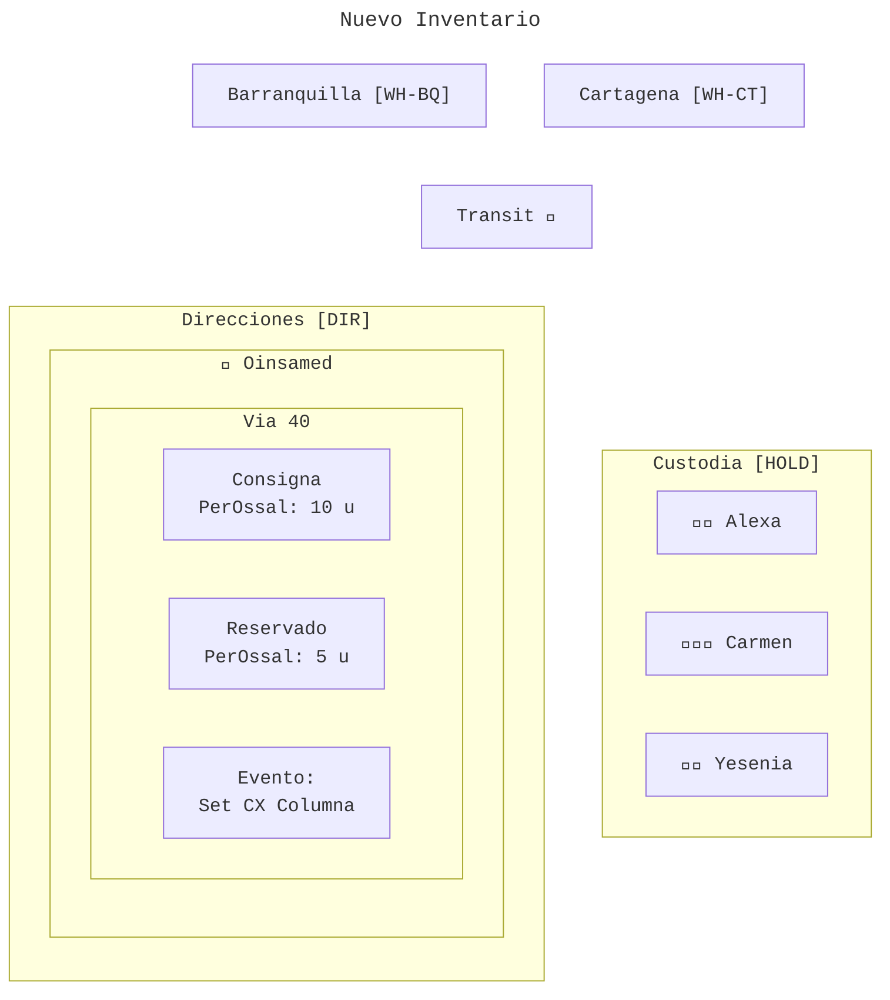
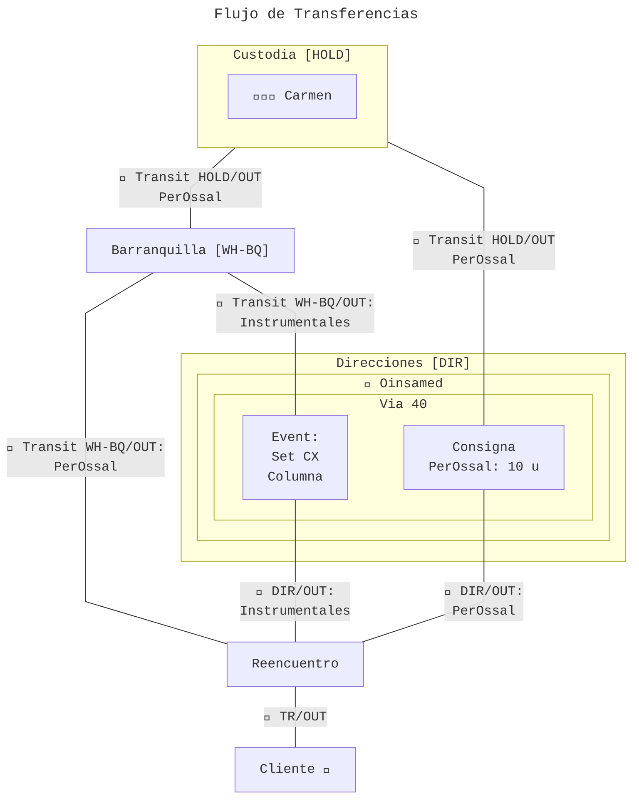
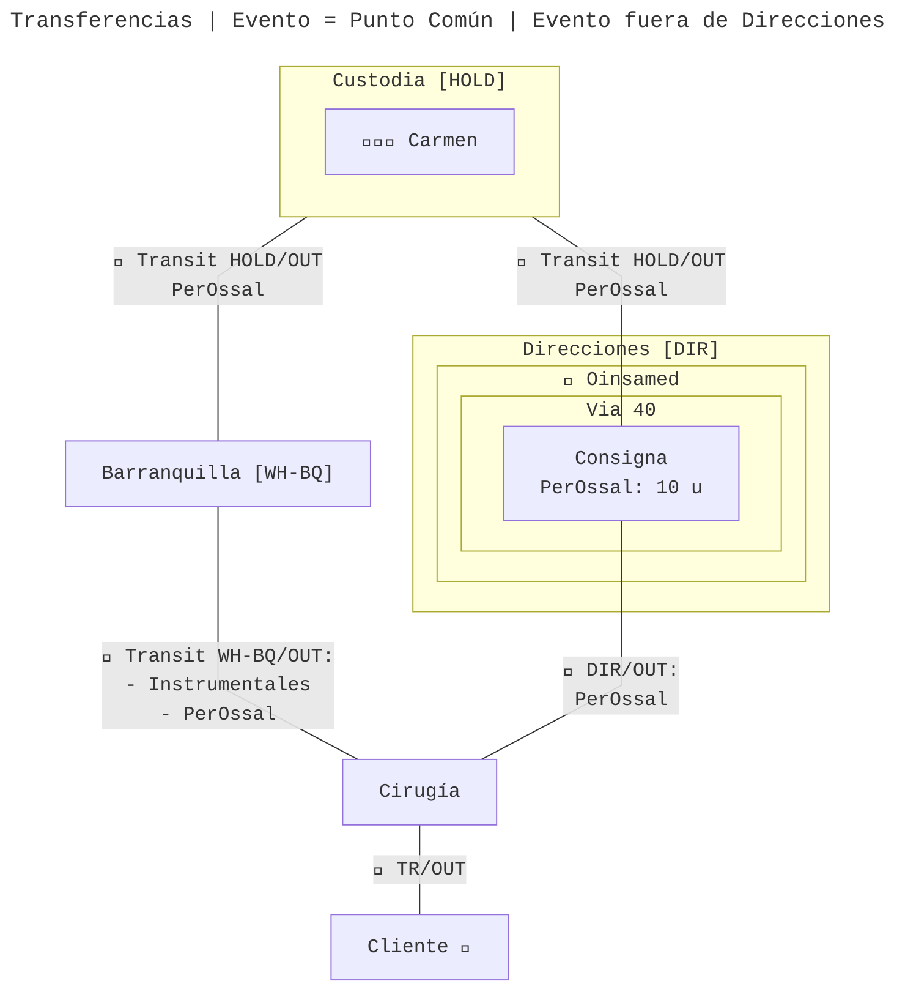
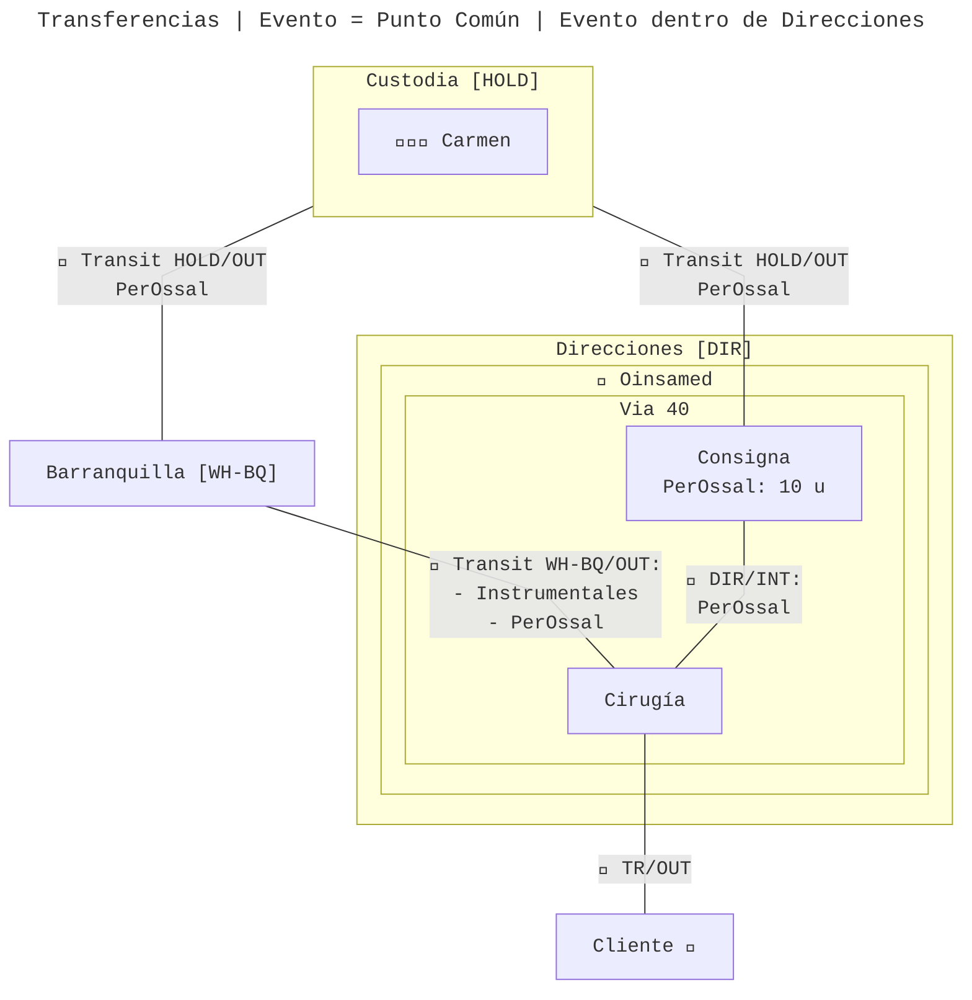

# Inventario

El nuevo inventario consta de la siguiente estructura:

- **Almacenes físicos:** sedes físicas tales como _Barranquilla_ (WH-BQ), _Cartagena_ (WH-CT), etcétera. Sus nombres cortos empiezan por "WH-"
- **Almacén Direcciones (DIR):** es el almacén que contiene las ubicaciones automáticas creadas para las direcciones de entrega de contactos de clientes, entidades prestadoras de salud y demás. La ubicación de existencias (stock) contendría ubicaciones hijas con la estructura `contacto/dirección de entrega` que a su vez pueden contener las siguientes ubicaciones:
  - **Consigna:** consigna donde somos consignadores (consignor); los productos de esta ubicación pueden ser usados en otros clientes
  - **Consigna no Compartida o Reservado:** consigna donde somos consignadores (consignor) pero cuyos productos deben usarse exclusivamente en el cliente actual
  - **Evento:** ubicación para desplazamiento temporal de material quirúrgico, como sets de instrumentales
- **Almacén Custodia (HOLD):** es el almacén que contendrá la mercancía dejada en custodia a vendedoras y contratistas. El stock contendrá ubicaciones con el nombre del contacto.
- **Ubicaciones de tránsito:** ubicaciones auxiliares para tránsito entre almacenes

## Flujo de inventario

La propuesta de inventario de gerencia se basa en la creación de un mega almacén llamado _Direcciones_ que contenga las ubicaciones de consigna y evento.

Ya que se necesita que la última transferencia antes de llegar a _Clientes_ contenga todos los productos que van a ser entregados para ingresar datos de la hoja de gasto, **se requeriría una ubicación de convergencia** o punto común en todas las rutas.

La ventaja de este diseño es que Direcciones representa las direcciones físicas de forma virtual: es como una maqueta de las ubicaciones existentes de las direcciones de entrega.

La desventaja en este diseño es que si las ubicaciones de evento simplemente sirven como una pasarela para los instrumentales, se crearían **demasiadas transferencias**.

## Propuesta de inventario

Algo que reduciría el número de transferencias es que las ubicaciones de evento se conciban como "el lugar de la cirugía" o evento quirúrgico donde terminan todos los productos antes de llegar a clientes, todos, sin excepción, independientemente de si son o no instrumentales.

Ésta ubicación de cirugía podría estar dentro o fuera de Direcciones. El diseño tendría más sentido si estuviera dentro del almacén Direcciones, pues eso facilitaría la trazabilidad de los instrumentales sin la necesidad de duplicar el árbol de ubicaciones.

> [!TIP]
> La trazabilidad de los sets podría manejarse usando un campo de ubicación o simplemente agrupando los lotes/seriales por set en alguna vista de existencias o ubicaciones, quitando la necesidad de guardar los sets en ubicaciones exclusivas para ellos durante las ventas.

## [:back:](README.md)
