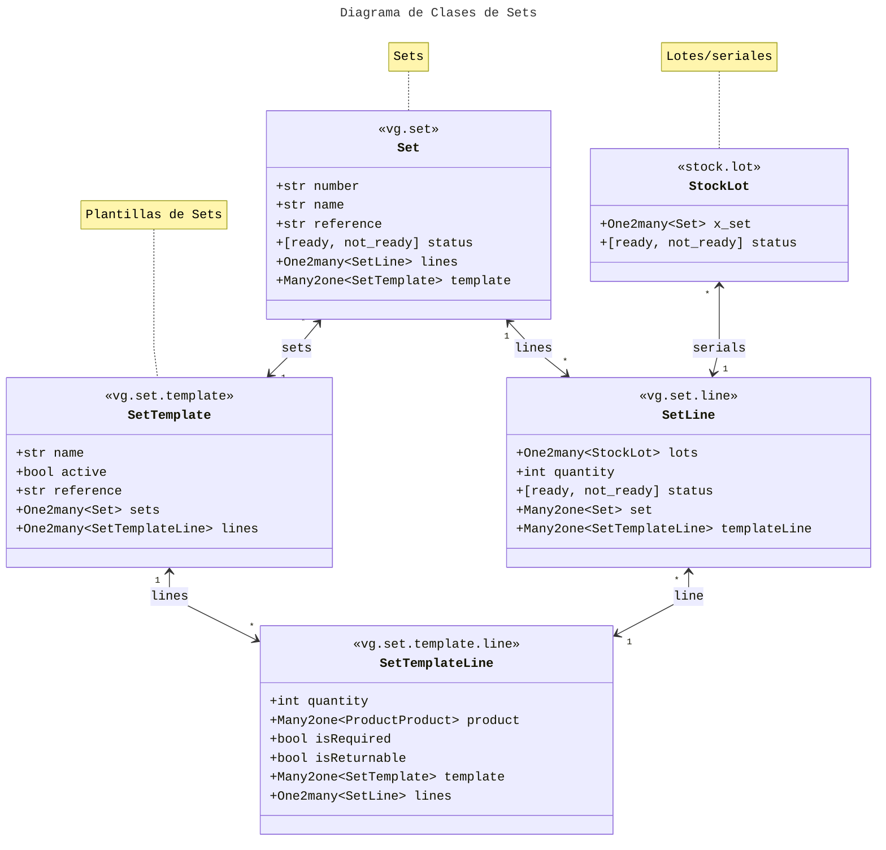

# Sets

Ante la necesidad de una mejor administración de activos tales como aquellos usados en procedimientos clínicos como cirugías y demás, se plantea la creación de unos nuevos modelos Set y SetTemplate.

## Problema

Saber dónde se encuentran los lotes o seriales de productos específicos de sets quirúrgicos.

## Modelos

### SetTemplate

El modelo de _SetTemplate_ o _Plantilla de Set_ tiene la función de indicar las mínimas cantidades y condiciones de uso de los productos dentro de un set. Ejemplo:

---

**Plantilla de Set**  
_Nombre:_ Kit Vital Básico  
_Referencia:_ vbasic

|      Producto       | Cantidad Mínima |   ¿Es requerido?   |   ¿Es retornable?    |
| :-----------------: | :-------------: | :----------------: | :----------------: |
| Tijeras Punta Roma  |        1        | :heavy_check_mark: | :heavy_check_mark: |
|        Gasas        |        5        | :heavy_check_mark: |                    |
|   Esparadrapo 1 m   |        2        | :heavy_check_mark: |                    |
|  Guantes de Latex   |        4        | :heavy_check_mark: |                    |
|    Jabón Líquido    |        1        |                    | :heavy_check_mark: |
|  Bolsa de Gel Frío  |        1        |                    | :heavy_check_mark: |
|  Curitas Medianas   |       10        |                    |                    |
| Acetaminofen 500 mg |        4        |                    |                    |

---

Campos:

- **Referencia:** Referencia interna de los sets
- **Es requerido:** El set debe contener la cantidad mínima del producto si sale del almacén para una venta.  
- **Es retornable:** Si el producto es usado, luego de la venta debe regresar junto con el set.

### Set

El modelo de set tiene la función de agrupar la parte movible o identificable (lotes, seriales) de los productos según su plantilla, así como de indicar las cantidades actuales asociadas de esos productos. Cada set tiene un número, nombre y referencia únicos dentro de su clase. Tiene un campo estado que indica si el set cumple con las condiciones de la plantilla. Ejemplo:

---

**Plantilla de Set**  
_Nombre:_ Kit Vital Básico #1  
_Número:_ 1  
_Referencia:_ vbasic\_1  
_Estado:_ no preparado

|      Producto       | Cantidad |  Seriales/Lotes   |
| :-----------------: | :------: | :---------------: |
| Tijeras Punta Roma  |    2     | `TIJ001` `TIJ002` |
|        Gasas        |  ~~3~~   |     `GAS010`      |
|   Esparadrapo 1 m   |  ~~0~~   |                   |
|  Guantes de Latex   |  ~~2~~   |     `GUA020`      |
|    Jabón Líquido    |    1     |     `JLI017`      |
|  Bolsa de Gel Frío  |    0     |                   |
|  Curitas Medianas   |    4     |     `CUR060`      |
| Acetaminofen 500 mg |    1     |     `ACE090`      |

---

> [!IMPORTANT]  
> El set Kit Vital Básico no podría ser enviado mediante una órden de compra ya que no contiene las cantidades necesarias de gasas, esparadrapos ni guantes de latex.

#### Sets e Inventario

Para la creación de sets se utilizaría un wizard para preguntar la ubicación de dónde se obtendrían los lotes/seriales de los productos. Cuando el producto se rastrea por serial, la relación con el set es _el serial A del producto P sólo puede relacionarse con el set X_ (1 a 1); cuando el producto se rastrea por lotes, la relación con el set es _el lote A del producto P puede relacionarse con los sets X, Y y Z_ y _los sets X, Y y Z pueden relacionarse con los lotes A, B y C del producto P_. En palabras más simples, cuando el producto se rastrea por lotes, las validaciones deben relacionarse con el número de productos de un lote específico y para llenar la cantidad mínima de la plantilla, un set puede contener productos de varios lotes.

Sobre las ubicaciones, mientras estén en un mismo almacén, los lotes/seriales de un set pueden encontrarse dentro de ubicaciones diferentes, lo cual es importante para etapas de preparación relacionadas con productos retornables que podrían requerir limpieza, mantenimiento, armado. Las ubicaciones de los productos también influyen en el estado de sus set: todos los lotes/seriales de un set deberían encontrarse en stock luego de pasar por etapas de preparación para que el set se encuentre "Listo". Adicionalmente, los productos deberían tener una opción para señalar si se distribuyen exclusivamente dentro de sets ("¿Transferir sólo en sets?").

> [!caution]
> El sistema no debería permitir que un lote/serial de un producto relacionado con un set se distribuya de manera independiente en transferencias entre almacenes o de ventas.

#### Retorno de sets

Al confirmar la transferencia que manda los productos a clientes, se debe crear una nueva transferencia de retorno (clientes -> ubicación de origen) del set con los productos no usados y los usados retornables.

## [:back:](README.md)
